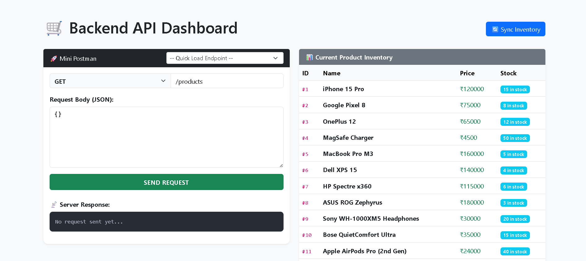
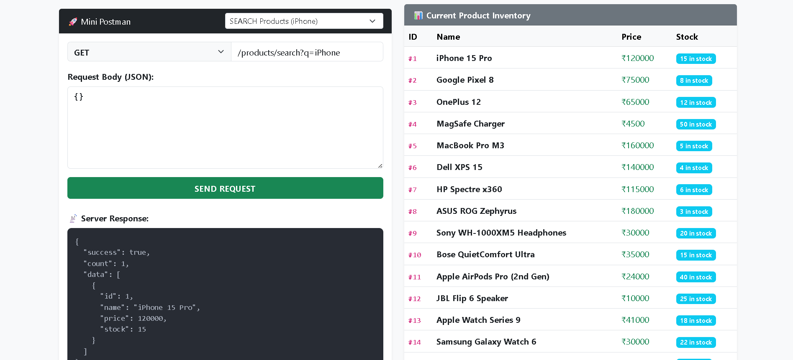
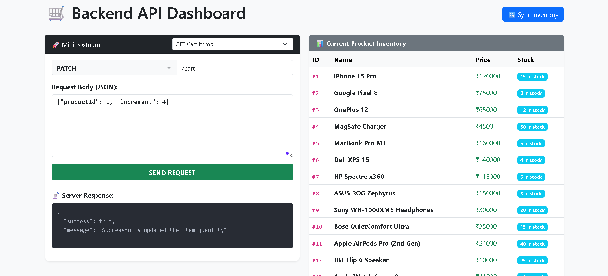
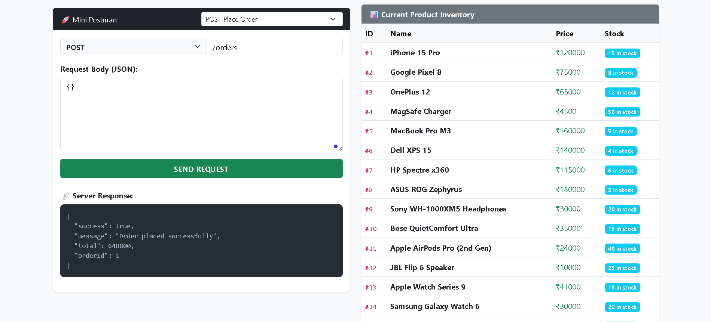
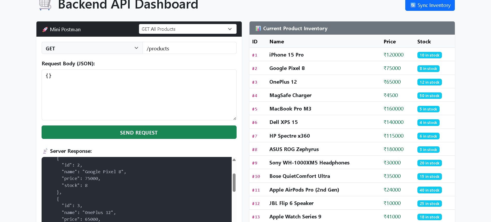

# 🛒 E-Commerce API System

> A production-ready REST API backend for managing products, carts, and orders — built with **Node.js**, **Express**, and **SQLite3**.

Designed with a clean **layered architecture**, transactional data integrity, and a **built-in browser dashboard** that lets you test every endpoint without leaving your browser.

---

## 🖥️ Built-in API Dashboard

Once the server is running, open your browser and navigate to:

```
http://localhost:5000
```

The dashboard is split into two panels side by side:

- **🚀 Mini Postman (left)** — A built-in request tester. Select an HTTP method, enter an endpoint URL, provide a JSON body, and hit **SEND REQUEST**. Pre-loaded endpoint shortcuts are available from the quick-load dropdown. The server response is displayed inline in the dark terminal panel below.
- **📊 Current Product Inventory (right)** — A live table showing all seeded products with their ID, name, price (₹), and colour-coded stock badge. Click **🔄 Sync Inventory** (top-right) to refresh after any stock-changing operation.

> No external tools needed for basic testing — just start the server and open the dashboard.

### Dashboard Overview


_The full dashboard on load: Mini Postman panel on the left pre-loaded with `GET /products`, and the live product inventory table on the right showing all seeded items with stock levels._

### Product Search


_Using the **SEARCH Products (iPhone)** preset loads `GET /products/search?q=iPhone`. The server response returns a filtered JSON result with `"count": 1` and the matching product — iPhone 15 Pro at ₹120,000 with 15 in stock._

### Update Cart Item Quantity


_A `PATCH /cart` request with body `{"productId": 1, "increment": 4}` updates the quantity of an existing cart item. The server responds with `"Successfully updated the item quantity"`._

### Place an Order


_A `POST /orders` request triggers the full checkout flow — SQL transaction, stock deduction, and order creation. The response confirms success with `"Order placed successfully"`, the computed `"total": 648000`, and the new `"orderId": 1`._

### Stock Deduction After Order


_After placing the order, a `GET /products` call shows the inventory has been updated in real time — iPhone 15 Pro stock has dropped from 15 to **10 in stock**, confirming the transactional stock deduction worked correctly._

---

## 🚀 Key Features

- **Layered Architecture:** Strict separation of concerns using the **Model-Controller-Route** pattern for high maintainability.
- **Persistent Cart:** A database-backed shopping cart that remains intact across page refreshes and sessions.
- **Transactional Orders:** Uses **SQL Transactions (BEGIN/COMMIT/ROLLBACK)** to ensure data integrity during the checkout process.
- **Stock Validation:** Automated real-time checks to prevent "over-selling" items that are out of stock.
- **Search & Discovery:** Partial-match search functionality using SQL `LIKE` queries for a seamless user experience.
- **Custom Middleware:** Dedicated middleware layer for request validation and error handling.
- **Validation & Security:** Robust input validation to handle invalid requests (e.g., negative prices or missing fields) and CORS enabled for frontend integration.
- **Built-in API Dashboard:** A browser-based Mini Postman UI served at `http://localhost:5000` for live endpoint testing without any external tools.
- **Environment Config:** Separate `env/` setup for easy environment variable management.

---

## 🛠️ Tech Stack

| Layer               | Technology                                    |
| ------------------- | --------------------------------------------- |
| **Runtime**         | Node.js (ES Modules)                          |
| **Framework**       | Express.js                                    |
| **Database**        | SQLite3                                       |
| **Template Engine** | EJS (for dashboard UI)                        |
| **Middleware**      | CORS, Express JSON Parser, Custom Validators  |
| **Testing**         | Built-in Dashboard / Postman / Thunder Client |

---

## 📂 Project Structure

```text
ECommerceBackendAPI/
├── config/             # Database connection & SQLite setup
├── controllers/        # Request handling & business logic
├── database/           # SQLite database files
├── env/                # Environment variable configuration (port, etc.)
├── middlewares/        # Custom middleware (validation, error handling)
├── models/             # SQL queries & database schema methods
├── routes/             # API route definitions
├── screenshots/        # README screenshots
│   ├── img1.png
│   ├── img3.png
│   ├── img4.png
│   ├── img6.png
│   └── img7.png
├── views/
│   └── index.ejs       # Browser dashboard (Mini Postman + Inventory table)
├── app.js              # Main entry point & middleware registration
├── seed.js             # Script to seed the database with example data
├── package.json        # Project metadata & scripts
├── package-lock.json   # Dependency lock file
├── .gitignore          # Git ignored files
└── README.md           # Documentation
```

---

## ⚙️ Setup & Installation

### 1. Clone & Install

```bash
git clone https://github.com/thecreatorzx/ECommerceBackendAPI.git
cd ECommerceBackendAPI
npm install
```

### 2. Environment Setup

Configure your environment variables inside the `env/` folder as needed. Currently it only contains the port variable — no extra setup required to get started.

### 3. Seed the Database

Populate the database with example products:

```bash
node seed.js
```

### 4. Start the Server

```bash
npm start
```

The API will be accessible at `http://localhost:5000`.

---

## 📡 API Endpoints

### 📦 Products Endpoints

| Method  | Endpoint                 | Description                             |
| ------- | ------------------------ | --------------------------------------- |
| `GET`   | `/products`              | Fetch all products in the catalog       |
| `GET`   | `/products/:id`          | Get details for a specific product      |
| `GET`   | `/products/search?q=...` | Search products by name (partial match) |
| `POST`  | `/products`              | Add a new product (Admin)               |
| `PATCH` | `/products/price`        | Update a product's price (Admin)        |
| `PATCH` | `/products/stock`        | Manually update stock levels (Admin)    |

**Example — Update Price:**

```json
PATCH /products/price
{ "id": 1, "price": 85000 }
```

### 🛒 Cart Endpoints

| Method   | Endpoint    | Description                                 |
| -------- | ----------- | ------------------------------------------- |
| `GET`    | `/cart`     | Retrieve all items in the current cart      |
| `POST`   | `/cart`     | Add a product to the cart / Update quantity |
| `PATCH`  | `/cart`     | Increment or decrement item quantity        |
| `DELETE` | `/cart/:id` | Remove a specific item from the cart        |
| `DELETE` | `/cart`     | Clear the entire cart                       |

**Example — Add to Cart:**

```json
POST /cart
{ "productId": 1, "quantity": 1 }
```

**Example — Update Quantity:**

```json
PATCH /cart
{ "productId": 1, "increment": 4 }
```

> **Note:** The cart add endpoint follows REST conventions as `POST /cart` rather than `POST /cart/add`. Both approaches are functionally equivalent — the RESTful style is preferred as the HTTP verb already communicates the intent.

### 🧾 Orders Endpoints

| Method | Endpoint      | Description                               |
| ------ | ------------- | ----------------------------------------- |
| `GET`  | `/orders`     | Fetch all orders                          |
| `GET`  | `/orders/:id` | Get details of a specific order by ID     |
| `POST` | `/orders`     | Place an order (triggers stock deduction) |

**Example — Place Order:**

```json
POST /orders
{ "items": [{ "productId": 1, "quantity": 5 }] }
```

**Example — Order Response:**

```json
{
  "success": true,
  "message": "Order placed successfully",
  "total": 648000,
  "orderId": 1
}
```

---

## 🧪 Testing

### Option A — Browser Dashboard (Quickest)

Start the server and visit `http://localhost:5000`. Use the **Mini Postman** panel with pre-loaded endpoint presets to test any route instantly. The right panel shows live inventory — hit **Sync Inventory** after any stock-changing operation to confirm updates.

### Option B — Postman / Thunder Client

1. **Product Discovery:** `GET /products/search?q=iPhone` — verifies partial-match search filters correctly.
2. **Constraint Validation:** Attempt to add a product with a negative price — server should respond with `400 Bad Request`.
3. **Atomic Checkout:**
   - Place an order for a quantity that exists → verify stock is deducted.
   - Place an order exceeding available stock → verify the transaction rolls back and no order is created.

---

## 🔭 Known Scope & Limitations

This project is scoped as a backend API assignment. The following are intentional omissions, not oversights:

- **No Authentication/Authorization** — endpoints are open by design for ease of evaluation. In a production system, admin routes (`POST /products`, `PATCH /products/price`) would be protected via JWT or session-based auth.
- **SQLite for storage** — ideal for local development and assignments. For high-concurrency production deployments, a client-server database like PostgreSQL or MySQL would be more appropriate as SQLite does not support concurrent writes.

---

## ✅ Final Submission Checklist

- [x] CORS enabled for cross-origin requests.
- [x] Layered Architecture (Routes ➔ Controllers ➔ Models).
- [x] Custom Middlewares for validation and error handling.
- [x] Database Transactions implemented for stock updates.
- [x] Built-in EJS dashboard served at `http://localhost:5000`.
- [x] Environment configuration via `env/` folder.
- [x] `"type": "module"` configured in `package.json`.

---

## 👤 Author

**MOHD SAAD** — [@thecreatorzx](https://github.com/thecreatorzx)  
[](https://www.linkedin.com/in/webdevmsaad/)
[](https://twitter.com/webdevmsaad)
